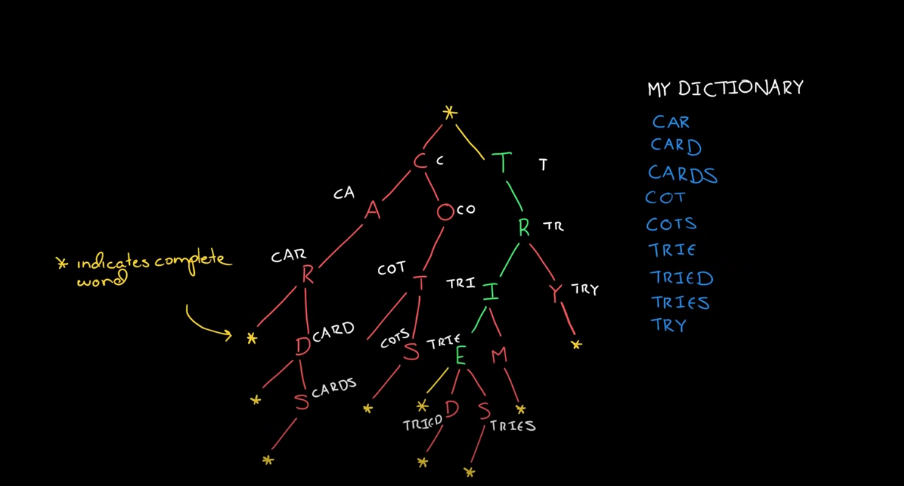

# Tries

Tries is a tree like data structure usually used to check validation of word. It cam be implemented with hash table(dict) to shorten the search time.



Taking above graph as an example, a tries is a tree with nodes containing character of a word , and mark end of a word with special character

To implement above tries with dictionary, we can do it like this:

Assume a list of words is input through a array --> words

```python
 def makeTries(words : list):
       table = {}
    
    for word in words:
        #set a pointer to mark current location ,  it should start from the root
        cur = table
        for letter in word:
            if letter not in cur:
                #create a new node(as a new key under dict)
                cur[letter] = {}
            #advance through next node (nested dict)
            cur = cur[letter]
        #after finsih letter loop, mark the end of word with special character
        if "*" not in cur:
            cur["*"] = 1
        else:
            cur["*"] +=1
        
    return table
```


Next thing is, after creating a tries, it is common to find if a new input is valid through dfs , to do so , remember again key of DFS:

1. set a base case where search can stop, in this case, search can stop when end of word is reached --> dict\[key] = "\*" , or letter not in dict\[key]
2. recursively call itself to search next node

```python
def dfs(table,word,pos):
    #base case, when reach end of word , return True
    if "*" in table:
        return True
    if word[pos] in table:
        return dfs(table[word[pos]],word,pos+1)
    else:
        return False
```


