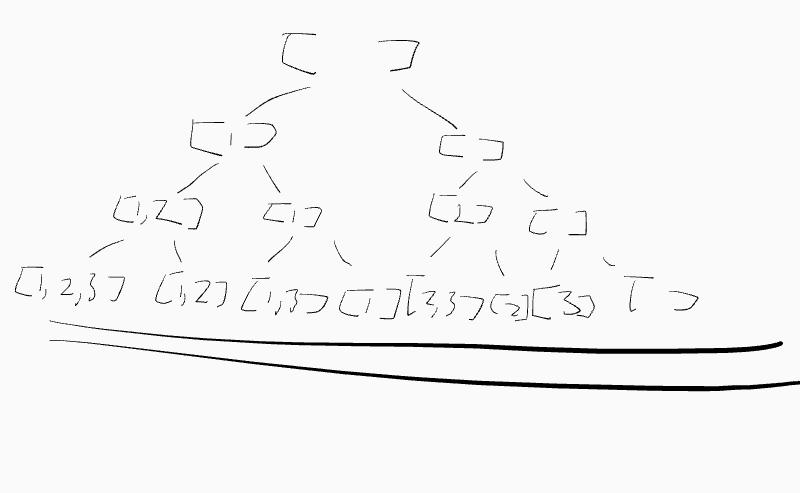

# Subset

Given an integer array `nums` of **unique** elements, return _all possible subsets (the power set)_.

The solution set **must not** contain duplicate subsets. Return the solution in **any order**.

&#x20;

**Example 1:**

```
Input: nums = [1,2,3]
Output: [[],[1],[2],[1,2],[3],[1,3],[2,3],[1,2,3]]
```

**Example 2:**

```
Input: nums = [0]
Output: [[],[0]]
```

&#x20;

**Constraints:**

* `1 <= nums.length <= 10`
* `-10 <= nums[i] <= 10`
* All the numbers of `nums` are **unique**.

## Solution(DFS)

take \[1,2,3,4] as an example.

The no of subset in a tree is like this

initially there are 4 branches, 1,2,3,4.

if 1 is selected it will create 3 more branches \[2,3,4]

if 2 is selected it will create 2 more branches \[3,4]

but if 3 is selected in previous step only 1 more branch \[4] will be created

So the pattern is like

```python
#input is the function is nums[i+1:]
# recursively call itself with above input

ans =[]
ret = []
def dfs(nums,ret):
    ans.append(ret)
    #no. of branches depends on new input list length
    for i in range(len(nums)):
        dfs(nums[i+1:],[ret+nums[i]])
```

```python
    def subsets(self, nums: List[int]) -> List[List[int]]:
        ans = []
    
        def dfs(nums, path):
            ans.append(path)
            for i in range(len(nums)):
                dfs(nums[i+1:], path+[nums[i]])

        dfs(nums, [])
        
        return ans
```


## Solution2(Backtracking)

Another way to think of the subset problem, is to think of it as if binary tree, when passing on every element in the array, we decide if the current element is to be included or not, like below graph



Since it is now a binary tree, we can use dfs to transvel through all node and return tree node

```python
#the tree has 3 level because length of array = level of tree
# start at level 0
#recursively add next element
#pop element at the end
#base case is when index >= len(nums)

        def dfs(i,ret):
            #base case, at leaf level
            if i >= len(nums):
                ans.append(ret[:])
                return
            ret.append(nums[i])
            dfs(i+1,ret)
            ret.pop()
            dfs(i+1,ret)

```

```python
class Solution:
    def subsets(self, nums: List[int]) -> List[List[int]]:
        ans = []
        ret = []

        def dfs(i,ret):
            if i >= len(nums):
                ans.append(ret[:])
                return
            ret.append(nums[i])
            dfs(i+1,ret)
            ret.pop()
            dfs(i+1,ret)
        
        dfs(0,ret)
        
        return ans

```

